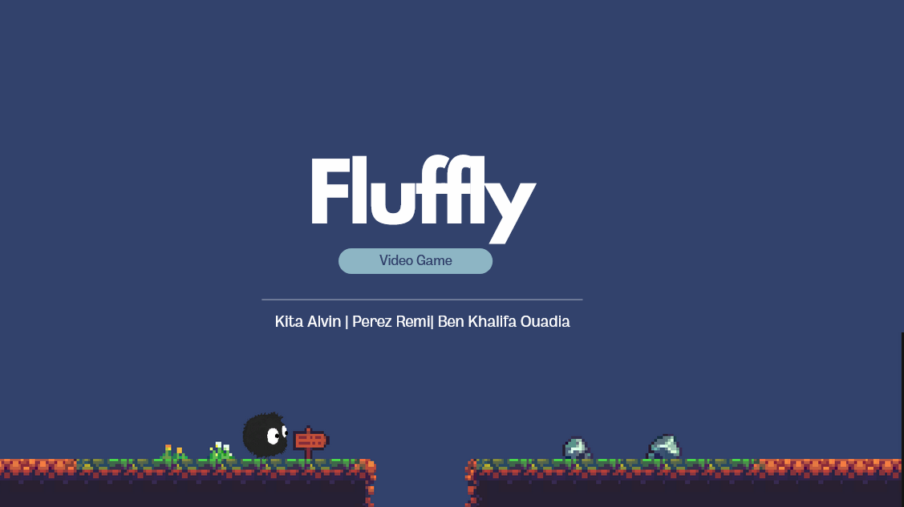

*TP réalisé en une journée dans le cadre du Module Programmation Mobile : Androïd avec Mr Axel FLEURY dans le cadre de la formation CPIL de L'IPI*

### Participants au projet :

- Alvin KITA
- Remi PEREZ
- Ouadia BEN KHALIFA

L'APK du projet est disponible dans le dossier `APK` du projet. [Lien de l'APK](APK/unityFinal.apk)

### Video de présentation du projet :

